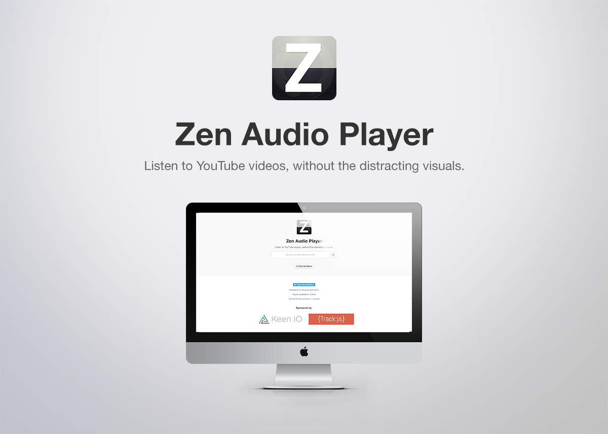

<p align="center">

<h1 align="center">Zen Audio Player</h1>
</p>


<p align="center">
	<a href="https://gitter.im/zen-audio-player/zen-audio-player.github.io?utm_source=badge&utm_medium=badge&utm_campaign=pr-badge"></a>
	<a href="https://travis-ci.org/zen-audio-player/zen-audio-player.github.io"></a>
  <a href="https://codeclimate.com/github/zen-audio-player/zen-audio-player.github.io"></a>
	<a href="https://codeclimate.com/github/zen-audio-player/zen-audio-player.github.io"></a>
	<a href="https://snyk.io/test/github/zen-audio-player/zen-audio-player.github.io/badges"></a>
</p>

<h2 align="center">Listen to YouTube videos, without the distracting visuals.</h2>

## Chrome Extension

Install the [Chrome extension](https://chrome.google.com/webstore/detail/zen-youtube-audio-player/jlkomkpeedajclllhhfkloddbihmcjlm) ([source code](https://github.com/zen-audio-player/extension-chrome)) so you can add `&zen` or `/zen` to the end of any YouTube URL to redirect this app!

## Bookmark

Create a bookmark with `javascript: (function () { window.location.href = 'https://zen-audio-player.github.io/?v=' + location.href; }());` as an URL to quickly redirect your YouTube video to this app!

### How to create a custom bookmark in Chrome:  
1. Click on a star at the right side of the omnibox (you can also press Ctrl+D (CMD+D on Mac) or choose "Bookmark this page..." from the menu).  
2. Name your bookmark.  
3. Click on "Edit".  
4. Paste the following snippet into the URL field
    ```
    javascript: (function () { window.location.href = 'https://zen-audio-player.github.io/?v=' + location.href; }());
    ```
5. Click on "Save".  

## Demo

* Listen to [Starve the Ego, Feed the Soul by The Glitch Mob](https://zen-audio-player.github.io/?v=koJv-j1usoI)
* Try it out on [zen-audio-player.github.io](https://zen-audio-player.github.io/).
* Clone the project and open `index.html`.
* To run the site locally, run `npm install` then `npm start` and a webpage will open in your default browser.

## Screenshot



## Browser Support

|Platform/Browser||||||
|:---:|:---:|:---:|:---:|:---:|:---:|
||Yes|-|Yes|Yes|Yes|
||Yes|Yes|Yes|-|-|
||No|No|No|-|-|
||No|-|No|-|-|

## Contributing to Zen Audio Player

If you would like to contribute to this project please read the [guidelines on contributing](.github/CONTRIBUTING.md) before doing so.

## Project Sponsors
|Sponsor|Description|
|:---:|---|
|[](https://trackjs.com/)                 |Track Better Errors. Actually Fix Bugs. Know when your users run into errors and fix bugs before they report them.|
